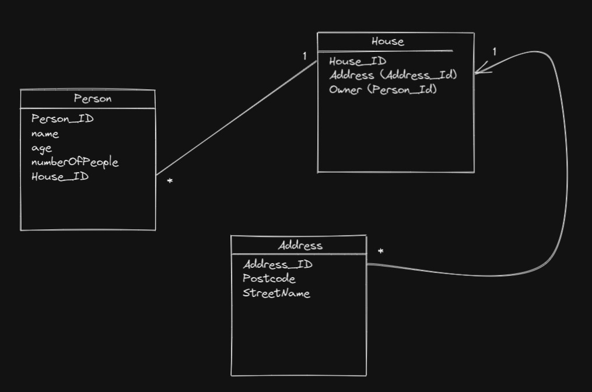

# houseAPI

## Getting started

### POST "/people"

#### Description
This adds a new person into the database.

#### Data to pass in body

* `person`: object with `name`, `age`, `peopleInHousehold`.

`name`: A string representing the person's full name.

`age`: An integer representing the person's age.

`peopleInHousehold`: An integer representing the number of people living in house.

---

### POST "/houses"

#### Description
This adds a new house into the database.

#### Data to pass in body

* `house`: object with `postcode`, `streetName`, `owner`.

`postcode`: A string representing the postcode of the house.

`streetName`: A string representing the name of the street where the house is.

`owner`: It's an integer or GUID representing the `id` of a person.

Before adding a new house, it is necessary to add the owner and get the `id` of the owner to add the new house. The backend will handle the correct insertion of the data.

---

### GET "/houses"

#### Description
This gives the user a list of all the houses, including the house `id` that can be used for requesting data for that specific house.

---

### GET "/houses/:id"

#### Description
This gives the user the `address` and `owner` of a particular house searching by its `id`.

---

### GET "/people?minAge=value&maxAge=value&peopleInHousehold=value"

#### Description
This gives the user all the `people` withing a cetain age brackets and specific household size.

`minAge`: An integer representing the minimum age needed to be included.

`maxAge`: An integer representing the maximum age needed to be included.

`peopleInHousehold`: An integer representing the number of people in household to be included.

## Schema

# Feedback from Brodie and Callum

*Very good layout, logically structured*

*It would be nice to see inline code snippets for the structure of the post request*

*The user might have been grateful for a way to view all houses for a way to search houses by address or owner*

*The schema diagram is a helpful representation of the system architecture*

*Overall a good and thorough solution to the exercise*
